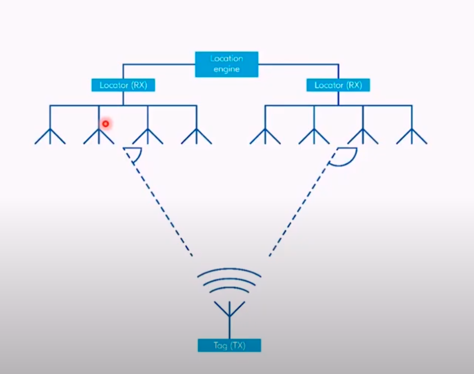

### Intro to Thread Networking Protocol: 
* Low power mesh network protocol for IoT
* based on 802.15.4 MAC/PHY
* built in security
* Open IPv6 based protocol 
  * Device to device and device to cloud connection 
* Seamless integration 

#### Thread specification 
* v1.0 introduced in 2014
* v1.1.1 launced in 2017 ,specification publicly available on Thread Group website
* v1.2 Launced in 2019.Spec is available to members

### Thread Networking Stack 

#### Primary features
* Built on proven technologies
* IEEE 802.15.4 the same radio protocol as used for Zigbeee networking protocol 
* IPv6 and 6LoWPAN based mesh network . 
* Encpsulation and Header Compression 
* No application layer defined in Thread specification.

 Thread Network --- Border Router --- WiFi/Ethernet --- Cloud
>  No need to have properietary gateway or translator
 
 #### Device types and roles
 
 * Full Thread Device (FTD)
  
   * most versatile in the roles
   * autonomous roles
   * subscribes to the all router multicast address, and maintains IPv6 address mapping
   * requires more HW resources e.g. memory size
   * always has its radio on, so it is usually a main powered device
 
 * Minimal Thread Device (MTD)
 
   * may perform certain roles
   * affiliate- does not subscribes to the all router multicast address and forwards all messages to its parent 
   * has the lowest requirements for HW resources 
   * may sleep to preserve energy , so it is often a battery-powered device
 
 * Router 
 
   * forwards packets for network devices
   * provides services for devices joining the network 
   * keeps its transceiver enabled at all times 
 
 * End Device
   * communicates primarily with a single router
   *  does not forward packets for other network devices
   * can disable its transceiver to reduce power
 
 > Linux Realtime 
  
   * In Kernel approach 
   
   * `Preempt RT` patch 
   
   * Most of the features already made it into "Mainline"
  
  * Huge community
   
   * Use standard glibc library 
   
   * Better than dual kernel aproach ( No need to maintain  microkernel)
   
   * Patch needed for realtime 
  
   * Preemption is the most important requirement for a Realtime system 
  
   * Determinisitic way for time critical application 
 
 ##### How Preempt RT brings Realtime to Linux ?
  * Locking Primitives: Spinlocks are replaced by `RT Mutexes`. Raw Spinlocks behave like the original Spinlocks. 
  * Interrupt Handlers run in Kernel Thread.
     Advantage: 
     *  Kernel thread is interruptible
     *  It shows in process id `pid`, can assign priority to interrupts
     
#### Thread Scalability 

* Thread 1.1 supports 32 routers per network and upto 511 end devices per router ,which allows to scale up to hunderds of devices per network . 

* Thread 1.2 enables of integration of multiple Thread networks and partitions into one `Thread domain` using a backbone link.

### Security 
* Comssioning - all devices joining the thread network have to be authenticated .
* User add devices to the network using app/website
* Data traffic  protection - all Thread communications are encrypted and authenticated using 802.15.4 secuirty mechanisms. 

### Reliability 
* Self healing mesh , using dynamic routing to route packets between nodes. 
* Self-configuring leader -> dynamic election of leader. all routers are capable of being a `leader`. If the leader fails, another router assumes the role.
* multiple border routers -> operating simultaneously providing multiple reduntant paths into and out of the network. 

### Efficiency 
* Low power devices , years of activity of battery powered devices. 
*Sleepy end devices (SED)  has its radio turned off idle periods and wakes periodically to commuicate with its parent router
* Synchronized sleepy end device( SSED) -> has its radio turned off during idle periods and wakes periodically to listen for messages from its parent at scheduled intervals. 

#### Open Thread project 
* OpenThread released by Google is an open source implementation of Thread networking protocol and other necessary components. 
* Key components: 
   * Core stack -> implementation of thread specification 
   * Border router -> implementation of Thread border router 
   * Comissioner -> implementation of Thread comissioner 
   * Network simulator -> simulates large scale thread network 

* Licensed under 3-clause BSD
* Open , community-based project , hosted on github 
[Open-Thread](https://github.com/openthread/)

### Application layer in Thread
* Thread protocol is application layer agnostic and does not define application layer
* Thread can simultaneously support maultiple application layer protocols on the same network. 

###  Matter (Formerly called Project Connected Home Over IP) (CHIP)

* New working group within Connectivity Standards Alliance(formerly called Zigbee Alliance).
* Matter was created with security and privacy as key design tenets.
* Apple Samsung, Google, Amazon are partners. 
* Convergence of Iot Wireless protocols such as `Bluetooth`, `Thread`, `WiFi`
* Matter is an application layer standard unifying the smart home industry 
* 

####  Matter Stack 

 > Matter focus on security (AES-128-CCM)

#### Role of BLE 
* BLE is used to commission a new device into the network using Matter controller e.g. a mobile device or home hub.
* BLE is NOT used for device to device communication or device to controller communication after commissioning is finalized. 
* Natter version 1.0 targets WiFi and Thread as main wireless connectivity protocols. 
* Thread for battery operated
* Wifi for high bandwidth requiring devices. 
  

### Bluetooth Low Energy 

* Bluetooth Special Interest Group
* Develop and license BLE technology 
* Bluetooth 5 , 2016
  * 2 Mbps
  * Long range
  * Advertising Extensions
  * 10 -> 20 dBm max Tx Power
* Bluetooth 5.1 - 2019
  * Direction Finding
* Bluetooth 5.2 - 2020
  * Ischronous channgels
  * LE power control 
  * Enhanced attribute protocol 

### Architecture
  
  

#### Profiles
* Describes how two or more devices can discover and communicate with each other
* Each profile has its own specification 
  

#### Host 
* Upper layers of BLE protocol stack 
* Logical Link Control and Adaptation Protocol 
* Attribute Protocol (ATT)
  * Simple client-server model
  * Client device can access attributs on the server device.
* Security manager protocolb (SMP)
  * Defines protocol for pairing and key distribution 

#### Host - GATT
* Generic Attribute Profile (GATT)
* Highest data layer 
* Uses ATT to discover and access attributes

#### Host - GAP 
* Generic Access Profile (GAP)
  * Highest control layer 
  * Defines device roles
  * Defines how devices discover and connect to each other
  * Defines security modes and procedures

#### Controller 

* Physical layer
  * defines how two radios can send bits to each other
  * 2.4 GHz ISM Band 
  * 40 RF channels(2 MHz)
  * GFSK modulation 
    * 1 or 2 Msps
  * Max 20 dBm Tx power

* Link layer
  * Defines link layer states
  * Defines device address
  * Packet format

#### LE Secure Connection 

* Added in Bluetooth Core Specs version 4.2(2014)
* Provides protection agains MITM attacks
* FIPS-approved algorithms
* Uses Elliptic Curve Diffie-Hellman (ECDH) key agreement
  * Allows two peers, each having public-private key pair, to establish secrete key over insecure channel 
  * Secret key used in derivation of encryption keys

#### Throughput and Range

* BLE 4.0/4.1
  * 1 Mbps
  * 27 byte payload
* BLE 4.2 
  * Data length extension 
  * 251 byte payload

* BLE 5
  * High throughput 2Mbps
  * reduced energy consumption 

### Direction Finding 

* Hallmark feature of Bluetooth 5.1 
* Requires radio changes
* Enables positioning solution to not only rely on RSSI but also the actual direction of a signal 
  

#### Use cases  

* Asset tracking 
  * Real-time location system RTLS
  * Indoor positioning 
  * Point of interest 
    * proximity marketing 
  * Item finding 
    * More advanced iterm finding solutions 

* Angle of Arrival (AoA)
  * Transmitter 
    * Simple beacon 
    * single antenna 
    * no I/Q calculations needed 

  * Receiver 
    * Advanced 
    * Antenna array and RF switch 
    * I/Q data needed for angle estimation 

#### Asset tracking -RTLS 
  * Real time location system 
  * AoA method 
  * Tag is a simple transmitter 
  * Multiple locator at fixed locations 
  * Each locator determines the direction of signal 
  * The location engine determins the position of tag 

#### LE Audio 

* Announced in Jan 2020
* Isochronous channels 
  * audio streaming to one or more connected devices 
  * channels are synchronised 
* New audio codec 
  * Low complexity communication coded (LC3)
* Broadcast audio for audio sharing 

### Ultra Wide Band 
#### What is UWB ? 
 
 UWB operates with the signal's so called *Time of Flight* rather than RSSI(Received Signal Strength Indicator) which makes the technology much more precise and enables it to make very exact ranging measurements.

* pulse radio technology based on `IEEE 802.15.4 Low Rate Wireless Personal Area Network`
* Uses impulse radio with extremely short pulses( <2ns)
* Uses very wide channels of at least 500 MHz
* Data rates of upto 27 Mbps

* `Indoor GPS` 
  * Unbeatably precise and stable 
    * `+-30 cm` accuracy  
* No interference with other radio communication system 
* Resistant to multipath signal propagation
* Use of low power trasceivers 
* Triangulation based on `Time difference of arrival`

#### UWB  Use Cases 

*  Secure Access Control 
  * Operates in close proximity ( a more secure solution than NFC)
  * Protection from eavesdropping and relay attacks
* Secure Wireless payments 
* Location based services 

